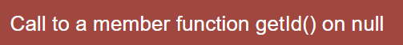
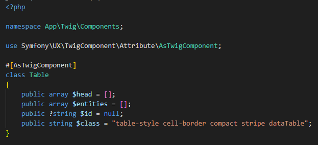
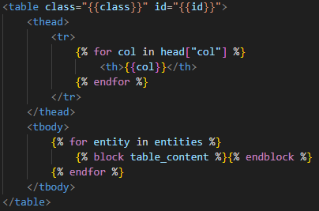
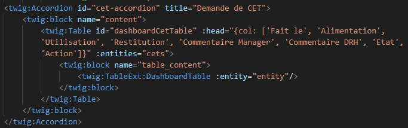
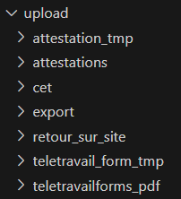

#DEV LOCAL

Plateforme de gestion de document avec workflow de validation statutaire

Avant de lancer le projet paramétrer votre .env.local en recopiant le .env.example

Installer les dépendances php via la commande composer install

Installer les dépendances js via la commande php bin/console importmap:install

Construire les conteneurs via docker compose up --build 

entrer dans le conteneur avec la commande docker compose exec app bash puis faites les commandes doctrine suivantes :

    - php bin/console d:d:c 
    - php bin/console d:m:m

Pour tester en local :

Afin d'avoir tous les rôles et pouvoir tester l'ensemble des fonctionnalités, dans la colonne role de la table USER attribuez-vous les rôles suivants :
- ["ROLE_USER", "ROLE_MANAGER","ROLE_ADMIN"]

Puis dans la table MANAGER **créez vous en tant que manager** et dans la colonne manager_id de la table USER ajoutez la clé étrangère correspondant à l'id de vous même en tant que manager.
Cela permettra **d'éviter cette erreur** lors de l'appel à /manager/dashboard:

##FRONTEND :

Pour certaines parties du front, on utilise des twig components. Cela permet de réutiliser le même HTML à différents endroits de l'application, 

Exemple avec App/Twig/Component/Table.php :

on vient définir des propriétés qu'on définit également dans le fichier twig pour indiquer leur emplacement dans le HTML : templates/components/Table.html.twig

Puis on va intialiser ces propriétés en appelant les composants dans un fichier ou on veut ajouter des tableaux, exemple dans templates/collaborator/dashboard.html.twig

**IMPORTANT** : Si vous utilisez un reformatage automatique pour les fichiers twig se situant dans le dossier component (Accordion.html.twig, Link.html.twig, etc...) : ATTENTION ! cela met en miniscule le nom des attributs et ceux-ci ne fonctionnent plus après... ils doivent toujours être en camelCase.

##BACKEND :

Concernant l'envoi des mails le dossier Email contient des gestionnaires permettant d'effectuer toute la logique de création de mail. 
C'est différent handler sont appelés dans le service : src/Service/SendEmailService.php et les méthodes du service sont appelées dans les controller.

Le dossier Controller suit la logique suivante : à la racine, les controller pour les collaborateurs, puis le dossier Manager pour les manager et enfin les dossiers RH et Admin pour les controller RH et la partie easy admin. Pour les templates il s'agit de la même logique.

**IMPORTANT** : Créer un dossier upload avec l'arborescence suivante 

Ce dossier contient tous les dossiers stockant les documents pdf générés et aussi quelques dossiers avec des fichiers temporaires permettant la concaténation de pdf (via ghost script).

 